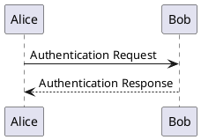

Local PlantUML Generator
========================
This allows a localhost server to server PlantUML-generated files, which will automatically render (i.e., Python file watchdog) and be updated to a client-viewing browser (i.e., websocket)

Current Generation Target
-------------------------
* PNG

Depedencies
-----------
To run this project, you will need to install the following non-standard library Python modules:

- `watchdog` - for monitoring file system events and triggering updates
- `websockets` - for establishing a WebSocket connection with the client-viewing browser

You can install these dependencies using pip:

```bash
pip install watchdog websockets
```

Once installed, you will be able to run the project successfully.
Also, the script will yell at you -- and reccomend the same!

Java & PlantUML Requirement
---------------------------
This project also requires Java and PlantUML to be installed on your system. You can download Java from the [official website](https://www.java.com/en/download/) and PlantUML from the [official website](https://plantuml.com/download).

Once installed, you will need to update the python script to point to the location of the PlantUML JAR file. For example:

```python
PlantUMLPath = os.path.expanduser("~/.local/plantuml/plantuml-1.2024.7.jar")
```

PlantUML Guide
--------------
The PlantUML website provides a [comprehensive guide](https://plantuml.com/guide) to help you get started with PlantUML. This guide covers everything from basic syntax to advanced features.

PlantUML Changes
----------------
For the latest changes, please refer to the [PlantUML Changes](https://plantuml.com/changes) page on the PlantUML website.

PlantUML `.puml` Example
------------------------

To generate PlantUML files, you will need to create a file with the `.puml` extension. You can then write your PlantUML code in this file. For example:

